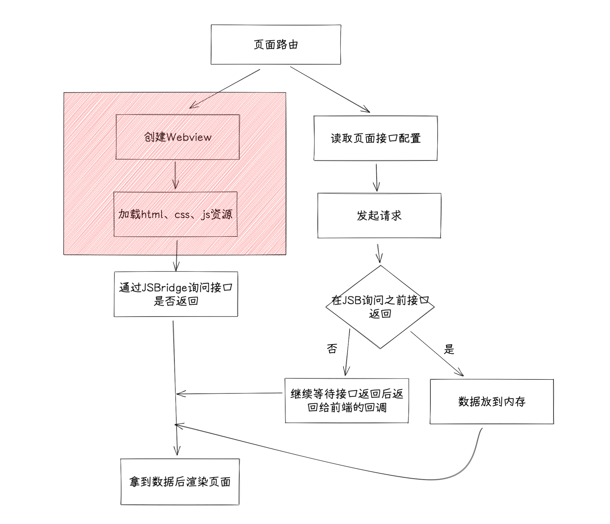

# 代码层面\[React\]

React 的内部实现方式注定了，在代码书写上需要做更多的注意可能带来的性能问题。

## 擅用 React.memo

```jsx
const MyComponent = React.memo(function MyComponent(props) {
  /* render using props */
})
```

**memo 做了什么**：memo 本身是一个 HOC（高阶组件）

```jsx
export function memo<Props>(
  type: React$ElementType,
  compare?: (oldProps: Props, newProps: Props) => boolean
) {
  const elementType = {
    $$typeof: REACT_MEMO_TYPE,
    type,
    compare: compare === undefined ? null : compare,
  }
  //
  return elementType
}
```

props 不变的情况下 直接跳过了当前节点的重渲染，直接复用（子组件还是会继续判断）

```jsx
if (compare(prevProps, nextProps) && current.ref === workInProgress.ref) {
  return bailoutOnAlreadyFinishedWork(current, workInProgress, renderLanes)
}
```

一个最简单的 Demo：

[react-ts-5gn99d - StackBlitz](https://stackblitz.com/edit/react-ts-5gn99d?file=App.tsx)

对于 Class Component 对应了 `PureComponent` 或者 `shouldComponentUpdate`。

## 擅用 useMemo 和 useCallback

示例代码：

```jsx
function GrandParent() {
  const [a, setA] = useState(0)
  // ...
  return <Parent someprops={a} />
}

function Parent({ someprops }) {
  // some expensive code
  return <Child someprops={someprops} />
}

function Child({ someprops }) {
  return <div>{someprops}</div>
}

function App() {
  return <GrandParent />
}
```

类组件 shouldComponentUpdate 可以帮助跳过当前组件的 re-render，但是函数组件没有生命周期的概念，没有直接规避上面 case 透传 props 带来的组件 re-render 的手段。所以对于复杂的渲染逻辑，可以使用 useMemo 包裹，在 dependency 不变的情况下不会重复触发复杂逻辑的执行

useCallback 同理。

## 合并更新

在 React v18 之前，只有 React Event Handler 中的连续 setState 会被 batchUpdate，React v18 之后支持了**Automatic Batching**。也就是说，在 v18 之前 setTimeout、Promise、native event handler……中的多次 setState 都不会 batchUpdate，会触发多次渲染

例：[React v18 Automatic Batching](https://stackblitz.com/edit/react-ts-eue8vn?file=App.tsx) vs [React v17](https://stackblitz.com/edit/react-ts-ekmdu9?file=index.tsx,App.tsx)

解决该问题的两种方式：

1. 升级 React 版本
1. 不能升级的情况下，在请求这类不会 batchUpdate 的情况下注意更新状态触发 re-render 的复杂度

## 非首屏必要组件延迟创建

## preload / prefetch / dns-prefetch

`preload`/`prefetch`  可控制 HTTP 优先级，从而达到关键请求更快响应的目的。

```tsx
<link rel="prefetch" href="style.css" as="style">
<link rel="preload" href="main.js" as="script">
<link rel="dns-prefetch" href="//shanyue.tech">
```

1. preload 加载当前路由必需资源，优先级高。一般对于 Bundle Spliting 资源与 Code Spliting 资源做 preload
1. prefetch 优先级低，在浏览器 idle 状态时加载资源。一般用以加载其它路由资源，如当页面出现 Link，可 prefetch 当前 Link 的路由资源。
1. `dns-prefetch`，可对主机地址的 DNS 进行预解析。

# 构建阶段

## 分析构建产物

先分析打包的产物，产物的哪个部分是异常的，如果使用 webpack 可以使用：

[https://github.com/webpack-contrib/webpack-bundle-analyzer](https://github.com/webpack-contrib/webpack-bundle-analyzer)

## 代码体积优化

### 提取冗余的代码

使用 splitChunksPlugin 提取冗余的代码（webpack v5 已内置）

[Code Splitting | webpack](https://webpack.js.org/guides/code-splitting/#splitchunksplugin)

### polyfill 优化

babel 提供了 es 新语法转换成低版本兼容的语法的能力，但是将所有的 polyfill 代码全部打包到代码中明显不合适（高版本支持性特性的不需要这些多余的代码），所以动态 polyfill 是优化代码体积的一种方式

`@babel/preset-env`和`core-js`根据需要支持的最低端版本将`Polyfill`打包进来，提供的 useBuiltIns 字段可以控制 polyfill 打包的方式：

- **false**：将所有`Polyfill`加载进来
- **entry**：根据`target.browsers`将部分`Polyfill`加载进来(仅引入有浏览器不支持的`Polyfill`，需在入口文件`import "core-js/stable"`)
- **usage**：根据`target.browsers`和检测代码里 ES6 的使用情况将部分`Polyfill`加载进来(无需在入口文件`import "core-js/stable"`)

所以使用 usage 的体积将会是最小的

`动态polyfill` 可根据浏览器 `UserAgent`返回当前浏览器`Polyfill`，其思路是根据浏览器的`UserAgent`从`browserlist`查找出当前浏览器哪些特性缺乏支持从而返回这些特性的`Polyfill`。对这方面感兴趣可参考[polyfill-library](https://link.juejin.cn/?target=https%3A%2F%2Fgithub.com%2FFinancial-Times%2Fpolyfill-library)和[polyfill-service](https://link.juejin.cn/?target=https%3A%2F%2Fgithub.com%2FFinancial-Times%2Fpolyfill-service)的源码。

- **官方 CDN 服务**：

[polyfill.io](https://polyfill.io/v3/polyfill.js)

使用`html-webpack-tags-plugin`在打包时自动插入。

[https://github.com/jharris4/html-webpack-tags-plugin](https://github.com/jharris4/html-webpack-tags-plugin)

```tsx
import HtmlTagsPlugin from 'html-webpack-tags-plugin'

export default {
  plugins: [
    new HtmlTagsPlugin({
      append: false, // 在生成资源后插入
      publicPath: false, // 使用公共路径
      tags: ['https://polyfill.alicdn.com/polyfill.min.js'], // 资源路径
    }),
  ],
}
```

### 异步按需加载

最直白的 case 就是 SPA 的非首屏的路由的 JS 资源，因为首屏展示的时候完全不需要所以完全可以将其加载的时间延迟到浏览器 idle 时间或者点击路由的时候。

Webpack 提供了 动态 import

```tsx
const Login = () => import(/* webpackChunkName: "login" */ '../../views/login')
```

React 提供了 React.lazy 来配合动态 import 来实现这一目的，并且 lazy 的组件需要放在 Suspense 组件中加载

```tsx
import React, { Suspense } from 'react'

const OtherComponent = React.lazy(() => import('./OtherComponent'))

function MyComponent() {
  return (
    <div>
      <Suspense fallback={<div>Loading...</div>}>
        <OtherComponent />
      </Suspense>
    </div>
  )
}
```

# 其他手段

> 压缩资源、使用 http2、使用 cdn、使用 gzip 这些老掉牙的面试八股文就不在文中复述了，这一般也不是前端工程师干的活，云厂商一般都会帮你干了。

## 资源离线

> 应该是大厂移动端 H5 优化的标配
> 需要客户端的配合

将网络 IO 的时间变成了本地文件的 IO，时间会节省一个到两个数量级甚至更多。

## 接口预请求

> 需要客户端的配合


将数据获取的时机从 JS 执行完提前到页面路由阶段，优化掉红色部分的时间
