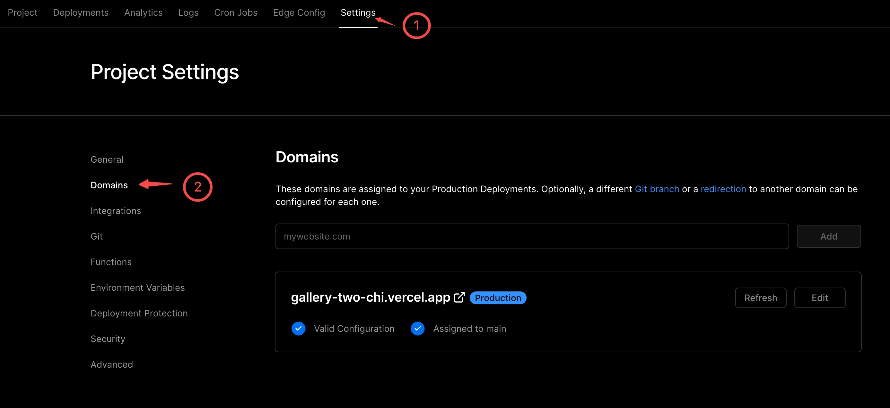
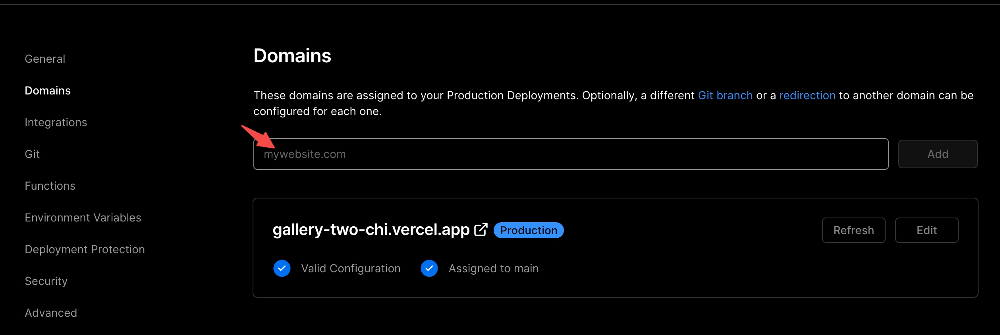
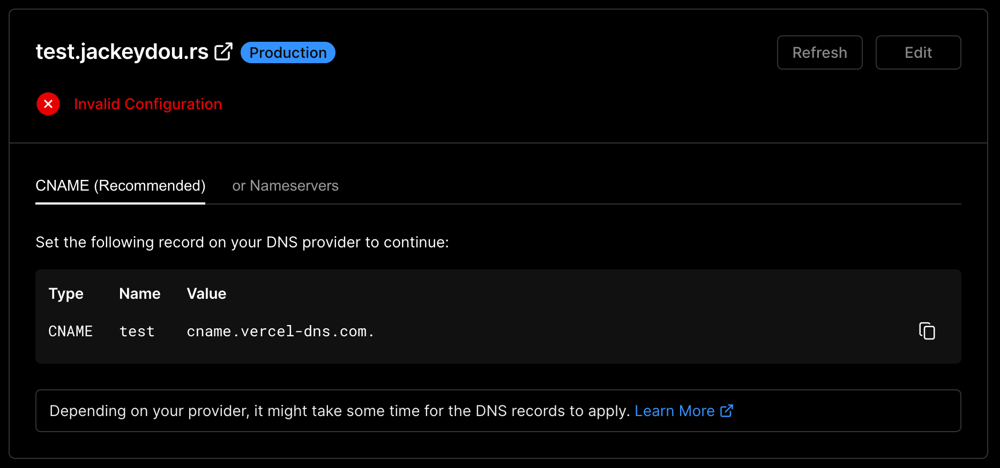
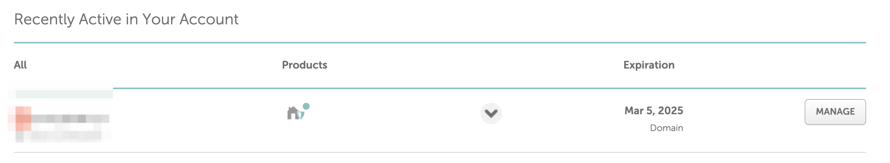
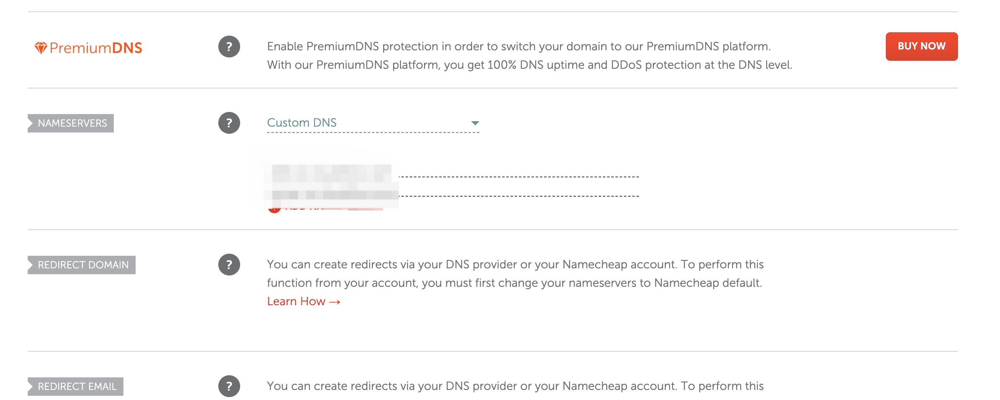

Vercel 的发布部署流程非常好用，所以将 Blog 迁移到 Vercel 上部署之后，在 namecheap 上买的域名想一同配置到 vercel 上，研究了下 vercel 的配置流程

## Vercel 配置

1. 在具体的项目下找到 Settings -> Domain:

2. 在输入框中输入要绑定的域名：
   

3. 找到配置报错信息，接下来要去 namecheap 配置域名的 DNS
   

## NameCheap 配置

1. 找到 NameCheap 要配置的域名：
   

2. 更改 DNS 配置
   

配置完后等待 DNS 更新完即可。
